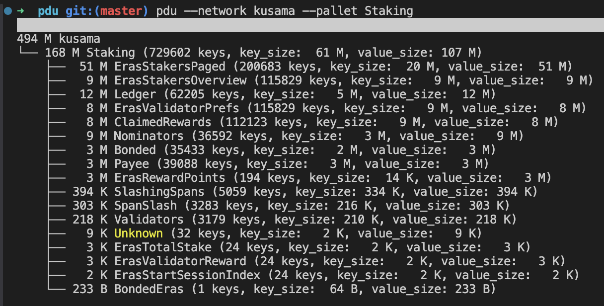

# polkadot-du

Investigate storage size of Substrate chains.

Install with: 

```sh
cargo install polkadot-du --locked
pdu --help
```

### Example: Info

First acquire a state snapshot. We are going to use the People Rococo chain, since it is rather
small. You will need the
[try-runtime-cli](https://paritytech.github.io/try-runtime-cli/try_runtime/) for this and a
full or archive node to download the state from:

```sh
try-runtime create-snapshot --uri wss://sys.ibp.network:443/statemint ah-polkadot.snap
```

Then run the analysis:

```sh
cargo run -r -- info --snap ah-polkadot.snap --rpc wss://sys.ibp.network:443/statemint
```

The results will be a bit boring for such a small network, but for a larger one - eg Kusama - it
could look like this. The results will also be written into a JSON file named `kusama_storage.json`.
You can download [this snapshot](https://tasty.limo/kusama.snap) to try it.


You can also zoom in on a specific pallet:

```sh
cargo run -r -- info --snap ah-polkadot.snap --rpc wss://sys.ibp.network:443/statemint --pallet System
```

Again for Kusama:



### Example: Grep

Search for an SS58 account address across the storage snapshot:

```bash
pdu grep --snap ../runtimes/polkadot.snap --rpc wss://sys.ibp.network:443/statemint address "15kr2dkeJQuCAfBQqZjnPeqmoMTWarRMxAGWPnfSmWdaVcbi"
```

## Example: Grep Parachain Sovereign Account

Search for the sovereign account of parachain 2034 (Hydration) in a Relay chain snapshot:

```bash
pdu grep --snap polkadot.snap --rpc wss://try-runtime.polkadot.io:443 para-account child 2034
```

### License

GPLv3 ONLY, see [LICENSE](./LICENSE) file for details.

License: GPL-3.0
